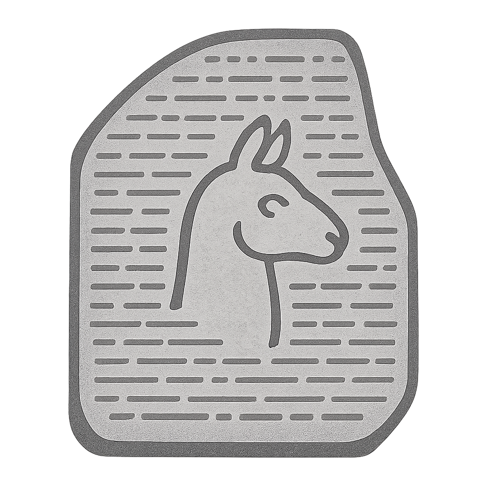

<p align="center">
  
</p>

# Cache-to-Cache: Direct Semantic Communication Between Large Language Models

Cache-to-Cache (C2C) enables Large Language Models to communicate directly through their KV-Caches, bypassing text generation. By projecting and fusing KV-Caches between models, C2C achieves 8.5–10.5% higher accuracy than individual models and 3.0–5.0% better performance than text-based communication, with 2.0× speedup in latency.

> **Why "Rosetta"?** The project is named after the **Rosetta Stone**, the ancient artefact that unlocked the translation of Egyptian hieroglyphs by presenting the same text in multiple scripts. Likewise, C2C translates KV-cache representations between otherwise independent LLMs, allowing them to speak a common language in a richer and more direct way.

Feel free to star the repo or cite the paper if you find it interesting.


## Environment Setup

Create a new environment:

```bash
conda create -n rosetta python=3.10
conda activate rosetta
```

Install the package:

```bash
pip install -e .
```

For training and evaluation, install additional dependencies:

```bash
pip install -e ".[training,evaluation]"
```

## How to

### Run an example

We provide an interactive chat example to demonstrate cache-to-cache communication with pre-trained projectors in `script/playground/live_chat_example.py`.

```bash
python script/playground/live_chat_example.py --checkpoint_dir PATH_TO_CHECKPOINT
```

### Apply Cache-to-Cache

You can apply C2C to your own models with a few lines of code. Here is an example:

```python
import torch
from transformers import AutoModelForCausalLM
from rosetta.model.wrapper import RosettaModel
from rosetta.model.projector import C2CProjector

# Load target and source models
target_model = AutoModelForCausalLM.from_pretrained("Qwen/Qwen3-0.6B")
source_model = AutoModelForCausalLM.from_pretrained("Qwen/Qwen2.5-0.5B-Instruct")

# Create C2C projector for KV-Cache transformation
projector_list = []
for i in range(target_model.config.num_hidden_layers):
    projector = C2CProjector(
        source_dim=128, target_dim=128,
        source_num_heads=8, target_num_heads=8,
        hidden_dim=1024, num_layers=3
    )
    projector_list.append(projector)
# If you want to use a pretrained projector, you can load it from the checkpoint directory

# Wrap with RosettaModel for cache-to-cache communication
c2c_model = RosettaModel(
    model_list=[target_model, source_model],
    base_model_idx=0,
    projector_list=projector_list
)

# Configure layer-wise projection mappings
for idx, layer_idx in enumerate(range(target_model.config.num_hidden_layers)):
    c2c_model.set_projector_config(
        source_model_idx=1, source_model_layer_idx=layer_idx,
        target_model_idx=0, target_model_layer_idx=layer_idx,
        projector_idx=idx
    )

# Use the model as usual, only pass in the kv_cache_index to indicate the source and target model for each token
seq_len = input_ids.shape[1]
instruction_index = torch.tensor([1, 0], dtype=torch.long).repeat(seq_len-1, 1)[None, :, :]
response_index = torch.tensor([[-1, 0]], dtype=torch.long)[None, :, :]
kv_cache_index = [torch.tensor([[1, 0]], dtype=torch.long)]
outputs = c2c_model.generate(
    kv_cache_index=[instruction_index, response_index]
    input_ids=inputs.input_ids,
)
```

### Train C2C Projectors

Prepare a training configuration file in `recipe/train_recipe/`. Specify the base model, teacher model, projector type and parameters, training hyperparameters, dataset, and output directory. See `recipe/train_recipe/C2C_0.6+0.5.json` for a complete example.

Run training:

```bash
# Single GPU
python script/train/SFT_train.py --config recipe/train_recipe/C2C_0.6+0.5.json

# Multi-GPU
export CUDA_VISIBLE_DEVICES=0,1,2,3,4,5,6,7
torchrun --nproc_per_node=8 script/train/SFT_train.py \
    --config recipe/train_recipe/C2C_0.6+0.5.json
```

During training, only the C2C projector parameters are updated while both source and target models remain frozen.

### Evaluate C2C

Prepare an evaluation configuration file in `recipe/eval_recipe/`. Specify the model configuration with base model, teacher model, checkpoint directory, generation config, evaluation dataset, and output directory. See `recipe/eval_recipe/unified_eval.yaml` for a complete example.

Run evaluation:

```bash
python script/evaluation/unified_evaluator.py --config recipe/eval_recipe/unified_eval.yaml
```

## Understanding the Code

### Code Structure

- `rosetta/`: The main package for Cache-to-Cache.
    - `model/`: Core model components.
    - `train/`: Training utilities.
    - `baseline/`: Baseline implementations.
    - `utils/`: Utility functions for evaluation and model registry.
- `script/`: Scripts for running experiments.
    - `train/`: Training scripts including `SFT_train.py`.
    - `evaluation/`: Evaluation scripts including `unified_evaluator.py`.
    - `dataset/`: Dataset preparation scripts.
    - `examples/`: Usage examples.
- `recipe/`: Configuration files.
    - `train_recipe/`: Training configurations (e.g., `C2C_0.6+0.5.json`).
    - `eval_recipe/`: Evaluation configurations (e.g., `unified_eval.yaml`).

### Adding Projector

Add a new projector architecture in `rosetta/model/projector.py`. The projector transforms source model's KV-Cache to target model's semantic space.

> Key components: projection networks (MLP/concat-based), gating mechanism for layer-wise selection, and temperature-annealed training. See `C2CProjector` in `rosetta/model/projector.py` as an example.

```python
from rosetta.utils.registry import register_model, capture_init_args

@register_model
@capture_init_args
class MyProjector(Projector):
    def __init__(self, source_dim, target_dim, **kwargs):
        super().__init__()
        # Your architecture
        self.projection = nn.Linear(source_dim, target_dim)
        self.gate = nn.Parameter(torch.tensor(0.0))
    def forward(self, source_kv, target_kv):
        # Project and fuse KV-caches
        return projected_kv
```

Register in configuration: `{"projector": {"type": "MyProjector", "params": {...}}}`

### Adding Dataset

Add a new dataset in `rosetta/train/dataset_adapters.py` for training with your data.

```python
@dataclass
class MyDatasetConfig(DatasetConfig):
    dataset_name: str = "my_dataset"
    def load(self):
        return load_dataset("path/to/dataset")

def my_formatting_func(examples):
    return {"text": [f"Q: {q}\nA: {a}" for q, a in zip(...)]}

DATASET_CONFIGS["MyDataset"] = MyDatasetConfig
FORMATTING_FUNCS["MyDataset"] = my_formatting_func
```

Use in configuration: `{"data": {"type": "MyDataset"}}`

### Adding Benchmark

Add evaluation logic in `script/evaluation/` following the pattern in `unified_evaluator.py`. The evaluator loads models, runs inference, and computes metrics for your benchmark dataset.

## Supported Model Pairs

### Qwen Family

* Qwen3-0.6B + Qwen2.5-0.5B-Instruct
* Qwen3-4B + Qwen3-0.6B

### Other Configurations

C2C supports arbitrary model pairs. The framework automatically handles:
- Different hidden dimensions
- Different number of layers
- Different attention head configurations
- Different tokenizers

To use custom model pairs, simply specify them in your configurations.