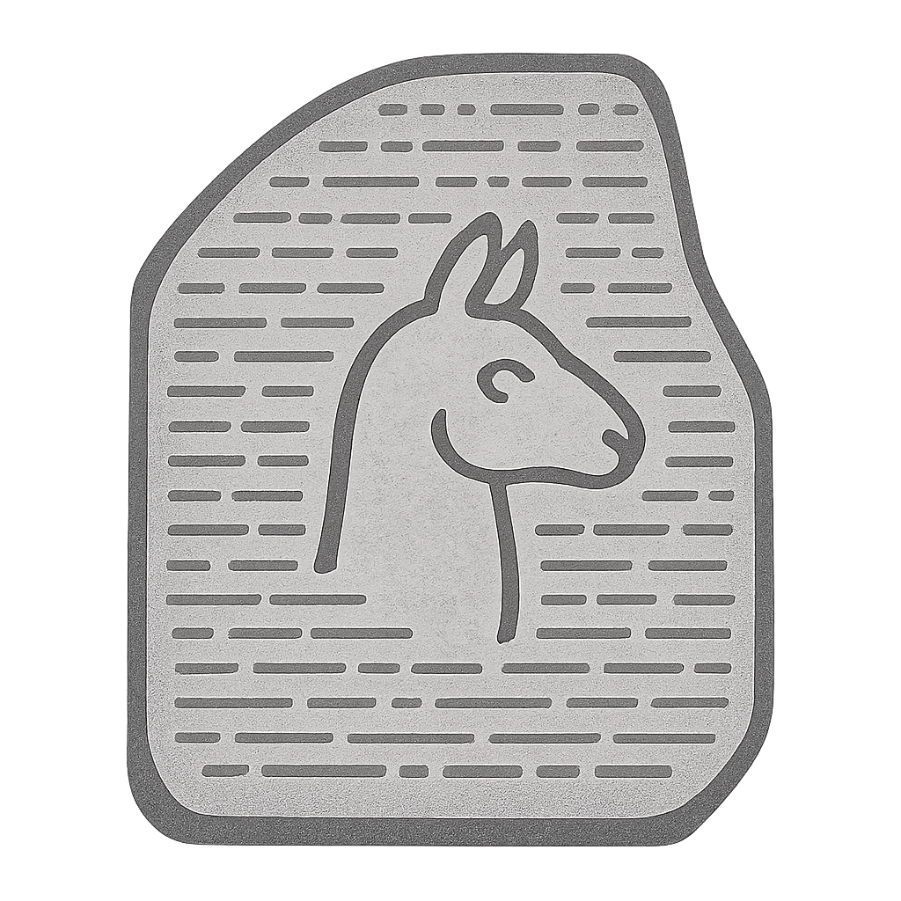

<div align="center">
  
  
  <h1>Cache-to-Cache</h1>
  <h3>Direct Semantic Communication Between Large Language Models</h3>

  <p>
    <a href="https://fuvty.github.io/C2C_Project_Page/">🌐 <b>Project Page</b></a> •
    <a href="https://arxiv.org/abs/2510.03215">📑 <b>Paper</b></a> •
    <a href="https://huggingface.co/nics-efc/C2C_Fuser">🤗 <b>HuggingFace</b></a> •
    <a href="https://huggingface.co/spaces/nics-efc/C2C_demo">🚀 <b>Live Demo</b></a>
  </p>

</div>

Cache-to-Cache (C2C) enables Large Language Models to communicate directly through their KV-Caches, bypassing text generation. By projecting and fusing KV-Caches between models, C2C achieves 6.4–14.2% higher accuracy than individual models and 3.1–5.4% better performance than text-based communication, with 2.5× speedup in latency.

Feel free to star the repo or cite the paper if you find it interesting.

```bibtex
@article{fu2025c2c,
    title={Cache-to-Cache: Direct Semantic Communication Between Large Language Models}, 
    author={Tianyu Fu and Zihan Min and Hanling Zhang and Jichao Yan and Guohao Dai and Wanli Ouyang and Yu Wang},
    journal={arXiv preprint arXiv:2510.03215},
    year={2025},
}
```

> **Why "Rosetta"?** The Python package is named after the **Rosetta Stone**, the ancient artefact that unlocked the translation of Egyptian hieroglyphs by presenting the same text in multiple scripts. Likewise, C2C translates KV-cache representations between otherwise independent LLMs, allowing them to speak a common language in a richer and more direct way.


## News

[2026/09] 🤔 We will soon be releasing agent-managed KV-Cache in this repo, along with the corresponding serving system, as our next step forward. Stay tuned!

[2026/01] 🎉 Our paper is accepted by the ICLR'26 conference. Welcome to discuss more about it in Brazil.

[2025/12] 🧪 Multi-sharer support is now available! Fuse KV-caches from multiple sharer models to a single receiver. This feature is in preliminary stages and we are still actively working on it. See `live_chat_example.py` for usage.

[2025/11] 🚀 Thank you for the enthusiasm from the community! [Live demo](https://huggingface.co/spaces/nics-efc/C2C_demo) is now available! Try C2C in action with side-by-side model comparison.

[2025/10] 🤗 Our paper is featured as the **#1 Paper of the Day** on [Hugging Face Daily Papers](https://huggingface.co/papers/2510.03215)

## Demo

<details open>
<summary><b>Combined Wisdom</b></summary>

> Only by combining latent semantics from both Qwen2.5 and Qwen3 can this philosophical question be correctly answered.
> 
> https://github.com/user-attachments/assets/c36ffaa1-0297-4ed8-b472-1fbbd9cc397f

</details>

The demo can be reproduced with `script/playground/gradio_demo.py`.

## Environment Setup

Create a new environment:

```bash
conda create -n rosetta python=3.10
conda activate rosetta
```

Install the package:

```bash
pip install -e .
```

For training and evaluation, install additional dependencies:

```bash
pip install -e ".[training,evaluation]"
```

## How to

### Use existing C2C Fusers

Minimal example to load published C2C Fuser weights from the Hugging Face collection and run the provided inference script. See the [full list of available fuser pairs](#supported-model-pairs). 

```python
import torch
from huggingface_hub import snapshot_download
from script.playground.inference_example import load_rosetta_model, run_inference_example

checkpoint_dir = snapshot_download(
    repo_id="nics-efc/C2C_Fuser",
    allow_patterns=["qwen3_0.6b+qwen2.5_0.5b_Fuser/*"],
)

model_config = {
    "rosetta_config": {
        "base_model": "Qwen/Qwen3-0.6B",
        "teacher_model": "Qwen/Qwen2.5-0.5B-Instruct",
        "checkpoints_dir": f"{checkpoint_dir}/qwen3_0.6b+qwen2.5_0.5b_Fuser/final",
    }
}

rosetta_model, tokenizer = load_rosetta_model(model_config, eval_config={}, device=torch.device("cuda"))
device = rosetta_model.device

prompt = [{"role": "user", "content": "Say hello in one short sentence."}]
input_text = tokenizer.apply_chat_template(prompt, tokenize=False, add_generation_prompt=True, enable_thinking=False)
inputs = tokenizer(input_text, return_tensors="pt").to(device)

instruction_index = torch.tensor([1, 0], dtype=torch.long).repeat(inputs['input_ids'].shape[1] - 1, 1).unsqueeze(0).to(device)
label_index = torch.tensor([-1, 0], dtype=torch.long).repeat(1, 1).unsqueeze(0).to(device)
kv_cache_index = [instruction_index, label_index]

with torch.no_grad():
    sampling_params = {
        'do_sample': False,
        'max_new_tokens': 256
    }
    outputs = rosetta_model.generate(**inputs, kv_cache_index=kv_cache_index, **sampling_params)
    output_text = tokenizer.decode(outputs[0, instruction_index.shape[1] + 1:], skip_special_tokens=True)
    print(f"C2C output text: {output_text}")
```

### Run chat example

We provide an interactive chat example to demonstrate cache-to-cache communication with pre-trained projectors in `script/playground/live_chat_example.py`.

```bash
# Single sharer
python script/playground/live_chat_example.py --checkpoint_dir path/to/checkpoint

# Multiple sharers (teacher models read from each checkpoint's config.json)
python script/playground/live_chat_example.py --checkpoint_dir path/to/ckpt1 path/to/ckpt2
```

### Apply C2C to any LLMs

You can apply C2C to your own LLMs with a few lines of code. We provide a universal `RosettaModel` wrapper.

<details>
<summary><b>Example code</b></summary>

```python
import torch
from transformers import AutoModelForCausalLM, AutoTokenizer
from rosetta.model.wrapper import RosettaModel
from rosetta.model.projector import C2CProjector

# Load target (receiver) and source (sharer) models
target_model = AutoModelForCausalLM.from_pretrained("Qwen/Qwen3-0.6B")
source_model = AutoModelForCausalLM.from_pretrained("Qwen/Qwen2.5-0.5B-Instruct")
tokenizer = AutoTokenizer.from_pretrained("Qwen/Qwen3-0.6B")

# KV-Cache shape of each model: (head dim, number of KV heads)
def kv_shape(config):
    head_dim = getattr(config, "head_dim", None) or config.hidden_size // config.num_attention_heads
    return head_dim, config.num_key_value_heads

source_dim, source_num_heads = kv_shape(source_model.config)  # (64, 2) for Qwen2.5-0.5B
target_dim, target_num_heads = kv_shape(target_model.config)  # (128, 8) for Qwen3-0.6B

# Create C2C projector for KV-Cache transformation
projector_list = []
for i in range(target_model.config.num_hidden_layers):
    projector = C2CProjector(
        source_dim=source_dim, target_dim=target_dim,
        source_num_heads=source_num_heads, target_num_heads=target_num_heads,
        hidden_dim=1024, num_layers=3
    )
    projector_list.append(projector)
# If you want to use a pretrained projector, you can load it from the checkpoint directory

# Wrap with RosettaModel for cache-to-cache communication
c2c_model = RosettaModel(
    model_list=[target_model, source_model],
    base_model_idx=0,
    projector_list=projector_list
)

# Configure layer-wise projection mappings, aligning the last layers of the two models
# (they can have different depths: 28 and 24 layers here)
num_target_layers = target_model.config.num_hidden_layers
num_source_layers = source_model.config.num_hidden_layers
offset = num_source_layers - num_target_layers
for layer_idx in range(num_target_layers):
    source_layer_idx = min(max(layer_idx + offset, 0), num_source_layers - 1)
    c2c_model.set_projector_config(
        source_model_idx=1, source_model_layer_idx=source_layer_idx,
        target_model_idx=0, target_model_layer_idx=layer_idx,
        projector_idx=layer_idx
    )

prompt = [{"role": "user", "content": "Say hello in one short sentence."}]
input_text = tokenizer.apply_chat_template(prompt, tokenize=False, add_generation_prompt=True, enable_thinking=False)
inputs = tokenizer(input_text, return_tensors="pt")

# Generate: kv_cache_index controls when to apply C2C projection
# [1, 0] = apply projection from sharer 1, [-1, 0] = no projection
seq_len = inputs.input_ids.shape[1]
instruction_index = torch.tensor([1, 0], dtype=torch.long).repeat(seq_len-1, 1)[None, :, :]
response_index = torch.tensor([[-1, 0]], dtype=torch.long)[None, :, :]
outputs = c2c_model.generate(
    kv_cache_index=[instruction_index, response_index],
    input_ids=inputs.input_ids,
    max_new_tokens=64,
)
```

</details>

### Train C2C Fusers

Prepare a training configuration file in `recipe/train_recipe/`. Specify the base model, teacher model, projector type and parameters, training hyperparameters, dataset, and output directory. See `recipe/train_recipe/C2C_0.6+0.5.json` for a complete example.

Run training:

```bash
# Single GPU
python script/train/SFT_train.py --config recipe/train_recipe/C2C_0.6+0.5.json

# Multi-GPU
export CUDA_VISIBLE_DEVICES=0,1,2,3,4,5,6,7
torchrun --nproc_per_node=8 script/train/SFT_train.py \
    --config recipe/train_recipe/C2C_0.6+0.5.json
```

During training, only the C2C projector parameters are updated while both source and target models remain frozen.

### Evaluate C2C

Prepare an evaluation configuration file in `recipe/eval_recipe/`. Specify the model configuration with base model, teacher model, checkpoint directory, generation config, evaluation dataset, and output directory. See `recipe/eval_recipe/unified_eval.yaml` for a complete example.

Run evaluation:

```bash
python script/evaluation/unified_evaluator.py --config recipe/eval_recipe/unified_eval.yaml
```

## Understanding the Code

Details on code structure and how to add custom projectors/datasets/benchmarks.

<details>
<summary><b>Expand to see</b></summary>

### Code Structure

- `rosetta/`: The main package for Cache-to-Cache.
    - `model/`: Core model components.
    - `train/`: Training utilities.
    - `baseline/`: Baseline implementations.
    - `utils/`: Utility functions for evaluation and model registry.
- `script/`: Scripts for running experiments.
    - `train/`: Training scripts including `SFT_train.py`.
    - `evaluation/`: Evaluation scripts including `unified_evaluator.py`.
    - `dataset/`: Dataset preparation scripts.
    - `examples/`: Usage examples.
- `recipe/`: Configuration files.
    - `train_recipe/`: Training configurations (e.g., `C2C_0.6+0.5.json`).
    - `eval_recipe/`: Evaluation configurations (e.g., `unified_eval.yaml`).

### Adding Projector

Add a new projector architecture in `rosetta/model/projector.py`. The projector transforms source model's KV-Cache to target model's semantic space.

> Key components: projection networks (MLP/concat-based), gating mechanism for layer-wise selection, and temperature-annealed training. See `C2CProjector` in `rosetta/model/projector.py` as an example.

```python
from rosetta.utils.registry import register_model, capture_init_args

@register_model
@capture_init_args
class MyProjector(Projector):
    def __init__(self, source_dim, target_dim, **kwargs):
        super().__init__()
        # Your architecture
        self.projection = nn.Linear(source_dim, target_dim)
        self.gate = nn.Parameter(torch.tensor(0.0))
    def forward(self, source_kv, target_kv):
        # Project and fuse KV-caches
        return projected_kv
```

Register in configuration: `{"projector": {"type": "MyProjector", "params": {...}}}`

### Adding Dataset

Add a new dataset in `rosetta/train/dataset_adapters.py` for training with your data. Register the class with `@register_dataset`; each item is a list of chat messages.

```python
@register_dataset
@capture_init_args
class MyChatDataset(Dataset):
    def __init__(self, split: str = "train", num_samples: Optional[int] = None):
        self.dataset = load_dataset("path/to/dataset", split=split)
        if num_samples is not None:
            self.dataset = self.dataset.select(range(min(num_samples, len(self.dataset))))

    def __len__(self):
        return len(self.dataset)

    def __getitem__(self, idx):
        sample = self.dataset[idx]
        return [
            {"role": "user", "content": sample["question"]},
            {"role": "assistant", "content": sample["answer"]},
        ]
```

Use in configuration: `{"data": {"type": "MyChatDataset", "kwargs": {"split": "train"}, "train_ratio": 0.99}}`

### Adding Benchmark

Add evaluation logic in `script/evaluation/` following the pattern in `unified_evaluator.py`. The evaluator loads models, runs inference, and computes metrics for your benchmark dataset.

</details>

## Supported Model Pairs

The following pre-trained C2C projectors are available on [🤗 Hugging Face](https://huggingface.co/nics-efc/C2C_Fuser/tree/main):

| Receiver Model | Sharer Model | Checkpoint |
|:---------------|:-------------|:-----------|
| Qwen3-0.6B | Qwen2.5-0.5B-Instruct | [🔗 Link](https://huggingface.co/nics-efc/C2C_Fuser/tree/main/qwen3_0.6b+qwen2.5_0.5b_Fuser) |
| Qwen3-0.6B | Llama-3.2-1B-Instruct | [🔗 Link](https://huggingface.co/nics-efc/C2C_Fuser/tree/main/qwen3_0.6b+llam3.2_1b_Fuser) |
| Qwen3-0.6B | Qwen2.5-Math-1.5B | [🔗 Link](https://huggingface.co/nics-efc/C2C_Fuser/tree/main/qwen3_0.6b+qwen2.5_1.5b_math_Fuser) |
| Qwen3-0.6B | Qwen3-4B | [🔗 Link](https://huggingface.co/nics-efc/C2C_Fuser/tree/main/qwen3_0.6b+qwen3_4b_Fuser) |
| Qwen3-0.6B | Qwen3-4B-Base | [🔗 Link](https://huggingface.co/nics-efc/C2C_Fuser/tree/main/qwen3_0.6b+qwen3_4b_base_Fuser) |
| Qwen3-1.7B | Qwen2.5-1.5B-Instruct | [🔗 Link](https://huggingface.co/nics-efc/C2C_Fuser/tree/main/qwen3_1.7b+qwen2.5_1.5b_Fuser) |
| Qwen3-8B | Qwen2.5-7B-Instruct | [🔗 Link](https://huggingface.co/nics-efc/C2C_Fuser/tree/main/qwen3_8b+qwen2.5_7b_Fuser) |

### Custom Model Pairs

C2C supports arbitrary model pairs beyond those listed above. The framework automatically handles:
- Different hidden dimensions
- Different number of layers
- Different attention head configurations
- Different tokenizers

To use custom model pairs, simply specify them in your training/evaluation configurations.

## Related Projects

Explore more efficient LLM projects from us:

<table style="border: none; border-collapse: collapse;" align="center">
<tr>
<td align="center" valign="top" width="25%" style="border: none; border-right: 1px solid rgba(128, 128, 128, 0.3); padding: 10px; min-width: 50px;">
<div style="height: 5em; display: flex; align-items: center; justify-content: center;">
<a href="https://github.com/thu-nics/R2R">

</a>
</div>
<a href="https://github.com/thu-nics/R2R"><b>R2R</b></a>
<br/><sub>Token-level routing for reasoning LLMs</sub>
</td>
<td align="center" valign="top" width="25%" style="border: none; border-right: 1px solid rgba(128, 128, 128, 0.3); padding: 10px; min-width: 50px;">
<div style="height: 5em; display: flex; align-items: center; justify-content: center;">
<a href="https://github.com/thu-nics/TaH">

</a>
</div>
<a href="https://github.com/thu-nics/TaH"><b>TaH</b></a>
<br/><sub>Selective latent thinking for reasoning LLMs</sub>
</td>
<td align="center" valign="top" width="25%" style="border: none; border-right: 1px solid rgba(128, 128, 128, 0.3); padding: 10px; min-width: 50px;">
<div style="height: 5em; display: flex; align-items: center; justify-content: center;">
<a href="https://github.com/thu-nics/FrameFusion">

</a>
</div>
<a href="https://github.com/thu-nics/FrameFusion"><b>FrF</b></a>
<br/><sub>Efficient video token reduction for LVLMs</sub>
</td>
<td align="center" valign="top" width="25%" style="border: none; padding: 10px; min-width: 50px;">
<div style="height: 5em; display: flex; align-items: center; justify-content: center;">
<a href="https://github.com/thu-nics/MoA">

</a>
</div>
<a href="https://github.com/thu-nics/MoA"><b>MoA</b></a>
<br/><sub>Mixture of sparse attention for LLMs</sub>
</td>
</tr>
</table>
